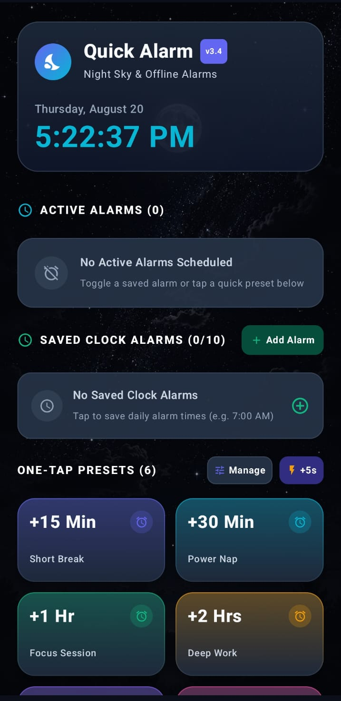
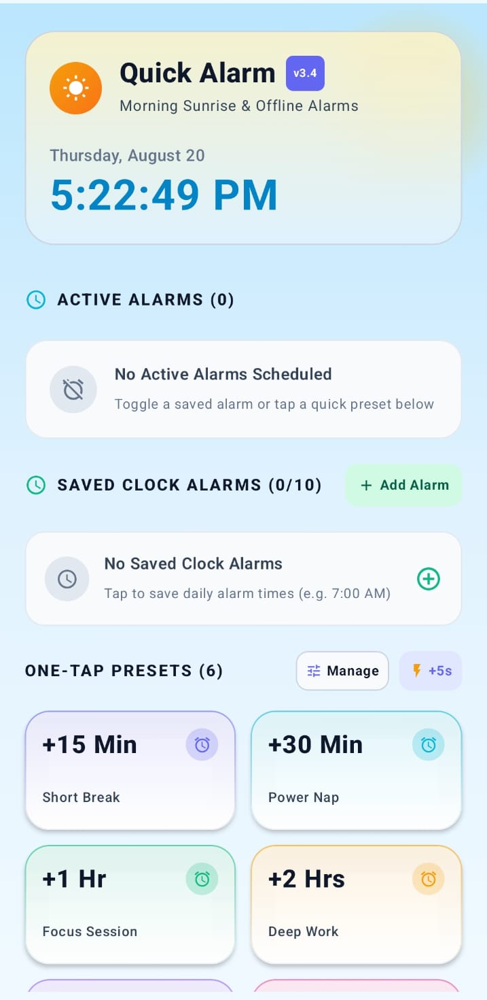
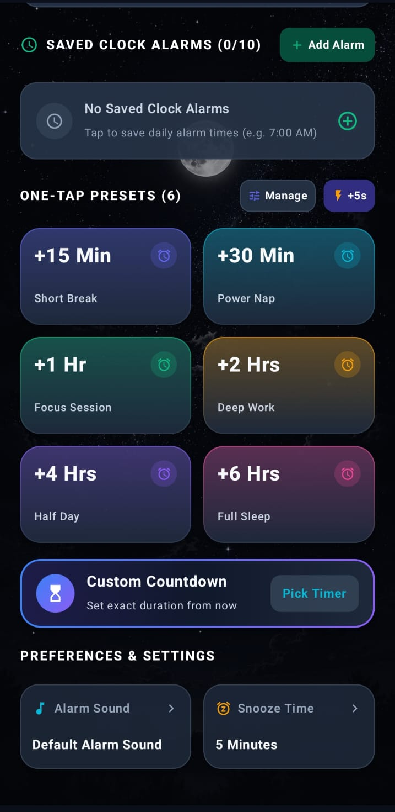
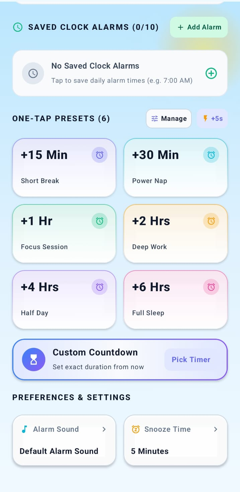

# Quick Alarm ⏰

A fast, lightweight, modern, and **100% offline** Android alarm and quick-timer application built with **Kotlin** and **Jetpack Compose**.

Quick Alarm is designed for instant action—schedule alarms in a single tap with customizable presets, manage stored daily clock alarms, pick sounds from your device's built-in ringtone library, and enjoy dynamic system Light & Dark mode adaptation featuring an aesthetic moonlit starry night sky in Dark Mode and a golden dawn sunrise in Light Mode.

---

## 📸 Screenshots

| Dark Mode (Starry Moonlit Night) | Light Mode (Early Morning Dawn) |
| :---: | :---: |
|  |  |
|  |  |

---

## 🌟 Key Highlights

* **🌙 Aesthetic Moonlit Night Sky (Dark Mode):** HD full moon & starry night background with frosted glassmorphism cards and pure white high-contrast text.
* **☀️ Early Morning Dawn & Sunrise (Light Mode):** Sky-blue atmosphere with a radiant golden dawn sun glow and bold deep-slate headings.
* **⚡ Instant One-Tap Presets:** Schedule countdown alarms instantly with customizable cards (e.g. `+15m`, `+30m`, `+1h`, `+2h`). Reorder, edit, and theme up to 10 presets with zero text overlap.
* **⏰ Saved Daily Clock Alarms:** Store up to 10 fixed time-of-day alarms (e.g. `07:00 AM`, `11:30 PM`) with quick-toggle switches and AM/PM time pickers.
* **⏳ Custom Countdown Timer:** Set exact countdown durations from right now (e.g. `45m`) with ±1m / ±5m step buttons and precision sliders.
* **🕒 Smart Automatic Time-of-Day Labeling:** Dynamically auto-generates context-aware alarm names based on the target trigger hour (`Early Morning Alarm`, `Morning Alarm`, `Afternoon Alarm`, `Evening Alarm`, `Late Night Alarm`).
* **🔔 Single-Source Foreground Audio Engine:** Reliable, loud continuous audio ringtone playback and vibration via `AlarmSoundService` even when the app is killed or device is locked, with zero dual-sound collisions.
* **🎵 Full OEM & Custom Sound Library:** Scans all pre-installed manufacturer ringtones asynchronously in the background and supports custom local audio files (`MP3`, `WAV`, `FLAC`, `OGG`, `AAC`) with live preview playback.
* **⚡ 120 FPS Zero-Lag Architecture:** Ticker recompositions are strictly isolated to leaf components with zero main-thread blocking.
* **🔒 100% Offline & Private:** Zero Firebase/network telemetry, zero cloud tracking, and zero personal data collection.

---

## 🛠️ Tech Stack & Tools

* **Language:** Kotlin 1.9+
* **UI Toolkit:** Jetpack Compose (Material 3)
* **Architecture:** Event-driven unidirectional state flow with isolated composable tickers
* **Alarm Scheduling:** Android `AlarmManager` (`setExactAndAllowWhileIdle` / `setAlarmClock`)
* **Audio Engine:** Android `MediaPlayer`, `RingtoneManager`, & `AlarmSoundService`
* **Storage:** Local `SharedPreferences` (JSON serialization)
* **Build System:** Gradle 8.7 with Android Gradle Plugin (AGP) 8.3.2
* **Target Platforms:** Android 8.0 (API Level 26) through Android 14+ (API Level 34)

---

## 📂 Project Structure

```
QuickAlarm/
├── app/
│   ├── src/main/
│   │   ├── java/com/quickalarm/app/
│   │   │   ├── MainActivity.kt               # Main entry point with dynamic theme provider
│   │   │   ├── AlarmActivity.kt              # Full-screen alarm ringing overlay & wake-lock
│   │   │   ├── AlarmSoundService.kt          # Single-source foreground media playback service
│   │   │   ├── AlarmReceiver.kt              # BroadcastReceiver triggering alarms & foreground service
│   │   │   ├── BootReceiver.kt               # BroadcastReceiver restoring alarms on device reboot
│   │   │   ├── model/
│   │   │   │   ├── AlarmItem.kt              # Active alarm data model
│   │   │   │   ├── PresetItem.kt             # Preset configuration model (colors, titles, minutes)
│   │   │   │   ├── SavedAlarmItem.kt         # Fixed daily clock alarm model
│   │   │   │   └── SoundItem.kt              # Device ringtone explorer & audio URI holder
│   │   │   ├── ui/
│   │   │   │   ├── screens/
│   │   │   │   │   ├── MainScreen.kt         # Primary dashboard with night/sunrise theme
│   │   │   │   │   ├── SavedAlarmDialog.kt   # AM/PM daily alarm picker modal
│   │   │   │   │   ├── CustomDurationDialog.kt # Relative countdown timer dialog
│   │   │   │   │   ├── SoundPickerDialog.kt  # OEM ringtone scanner & preview player
│   │   │   │   │   ├── SnoozeDurationDialog.kt # Snooze interval configuration
│   │   │   │   │   ├── PresetManageDialog.kt # Reorder (up/down), edit & delete presets
│   │   │   │   │   ├── PresetEditDialog.kt   # Dynamic title auto-sync & color picker
│   │   │   │   │   └── PermissionBanner.kt   # Android 13+ Notification & Exact Alarm permission cards
│   │   │   │   └── theme/
│   │   │   │       ├── Color.kt              # DarkAppPalette & LightAppPalette definitions
│   │   │   │       ├── Theme.kt              # Material 3 dynamic theme & status bar insets
│   │   │   │       └── Type.kt               # Typography definitions
│   │   │   └── util/
│   │   │       ├── AlarmScheduler.kt         # Exact AlarmManager scheduling & notification channels
│   │   │       └── AppSettings.kt            # Offline persistence manager
│   │   ├── res/                              # Drawables, themes, and XML metadata
│   │   └── AndroidManifest.xml               # Permissions, receivers & service definitions
│   ├── proguard-rules.pro                    # R8 / ProGuard rules for release builds
│   └── build.gradle.kts                      # App dependencies & SDK versioning
├── ss/                                       # App screenshots & promotional showcase assets
├── CHANGELOG.md                              # Detailed version-by-version changelog
├── PLAYSTORE_LISTING.md                      # Google Play Store listing copy & form answers
├── PRIVACY_POLICY.md                         # 100% Offline Privacy Policy
├── README.md                                 # Project documentation
├── build.gradle.kts                          # Root build configuration
├── settings.gradle.kts                       # Project repository settings
├── gradlew                                   # Linux/macOS Gradle wrapper
└── gradlew.bat                               # Windows Gradle wrapper
```

---

## 🚀 How to Build & Run

### 1. Prerequisites
Ensure you have the following installed on your machine:
* **JDK:** Java Development Kit 17 (e.g. OpenJDK 17)
* **Android SDK:** Android SDK Command-line Tools / SDK Platform 34
* **Git:** Installed and configured in PATH
* **Android Studio:** Hedgehog (2023.1.1) or newer *(Optional, for GUI development)*

---

### 2. Clone the Repository
```bash
git clone https://github.com/SagarMishra119/Quick-Alarm.git
cd Quick-Alarm
```

---

### 3. Build the APK & App Bundle

#### Windows (PowerShell)
```powershell
# Compile debug APK
.\gradlew.bat assembleDebug

# Compile production signed APK & Play Store App Bundle (.aab)
.\gradlew.bat assembleRelease bundleRelease
```

#### macOS / Linux (Terminal)
```bash
# Ensure wrapper has execution permissions
chmod +x gradlew

# Compile debug APK
./gradlew assembleDebug

# Compile production signed APK & Play Store App Bundle (.aab)
./gradlew assembleRelease bundleRelease
```

The output files will be generated at:
* **Debug APK:** `app/build/outputs/apk/debug/app-debug.apk`
* **Release APK:** `app/build/outputs/apk/release/app-release.apk`
* **Play Store Bundle (.aab):** `app/build/outputs/bundle/release/app-release.aab`

---

### 4. Install on an Android Device

Ensure **USB Debugging** is enabled on your Android phone, then run:
```bash
adb install -r app/build/outputs/apk/debug/app-debug.apk
```

---

## 📜 Android Permissions Explained

| Permission | Purpose |
| :--- | :--- |
| `SCHEDULE_EXACT_ALARM` / `USE_EXACT_ALARM` | Triggers alarms at precise target times via `AlarmManager`. |
| `POST_NOTIFICATIONS` | Displays heads-up alarm notifications and ringing alerts on Android 13+. |
| `FOREGROUND_SERVICE` / `FOREGROUND_SERVICE_MEDIA_PLAYBACK` | Ensures uninterrupted alarm audio playback and vibration when app is closed. |
| `RECEIVE_BOOT_COMPLETED` | Automatically reschedules active alarms after device reboots via `BootReceiver`. |
| `VIBRATE` | Provides haptic vibration feedback when an alarm rings. |
| `WAKE_LOCK` / `USE_FULL_SCREEN_INTENT` | Wakes up the screen and displays over the lock screen when an alarm fires. |

---

## 🔒 Privacy & Data Safety

Quick Alarm is built with a **strict offline-first privacy architecture**:
* **Zero Data Collection:** No personal data, location, analytics, or identifiers are collected or shared.
* **No Internet Access:** The application functions 100% offline without network dependencies.
* For the full policy, see [**PRIVACY_POLICY.md**](PRIVACY_POLICY.md).

---

## 📄 Changelog & Version History

For a complete record of all version releases, feature additions, and UI updates, see [**CHANGELOG.md**](CHANGELOG.md).

---

## 📄 License

This project is licensed under the MIT License — feel free to use, modify, and distribute it.
